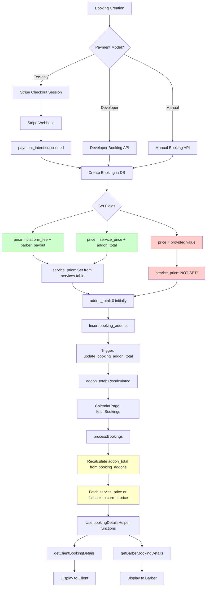

# Booking Details Calculation Evaluation

**Date:** January 2025  
**Purpose:** Comprehensive evaluation of booking details calculations from database insertion through retrieval to display in CalendarPage.tsx

## Executive Summary

This evaluation analyzes the booking details calculation flow to identify inconsistencies, document findings, and determine if database schema changes are needed. The system uses a fee-only payment model (customers pay platform fee only, service price paid at appointment) with developer accounts as a special case (no platform fee).

### Key Findings

1. **Database Schema Issues:**
   - The `price` field has ambiguous semantics across different booking types
   - `service_price` field was added but not consistently populated in all creation paths
   - No database constraint ensures `price = platform_fee + barber_payout` for fee-only bookings
   - Missing `service_price` can cause calculation errors

2. **Calculation Logic Issues:**
   - Complex logic in `bookingDetailsHelper.ts` with confusing comments
   - Different handling for developer vs. regular bookings
   - Inconsistent interpretation of what `price` represents

3. **Data Flow Issues:**
   - CalendarPage recalculates `addon_total` from `booking_addons` table even though a trigger maintains it
   - Redundant database queries for addon totals
   - Fallback logic for missing `service_price` may use incorrect current prices

4. **Payment Model:**
   - Fee-only: Customer pays platform fee only ($3.38), service price paid at appointment
   - Developer accounts: No platform fee, price = service_price + addon_total
   - `price` field stores different values for fee-only vs developer bookings

## Database Schema Analysis

### Current Schema (bookings table)

**Core Fields:**
- `price` (DECIMAL) - Constraint: `CHECK (price > 0)`
- `service_price` (DECIMAL) - Historical service price (added in migration 20250118000002)
- `addon_total` (DECIMAL) - Calculated by trigger from `booking_addons` table
- `platform_fee` (NUMERIC(10,2)) - BOCM's share
- `barber_payout` (NUMERIC(10,2)) - Barber's share from platform fee
- `payment_intent_id` (TEXT) - Stripe payment intent ID
- `payment_status` (TEXT) - Constraint: `IN ('pending', 'succeeded', 'failed', 'refunded')`
- `status` (TEXT) - Constraint: `IN ('pending', 'confirmed', 'completed', 'cancelled', 'no_show')`

### Constraints

1. **Price Constraint:** `CHECK (price > 0)` - Requires positive price
2. **Payment Status Constraint:** Defined in multiple migrations with slight variations
3. **No constraint** ensuring `price = platform_fee + barber_payout` for fee-only bookings
4. **No constraint** ensuring `service_price` is populated when required

### Triggers

1. **update_booking_addon_total()** - Recalculates `addon_total` from `booking_addons` table on INSERT/UPDATE/DELETE
   - Location: `supabase/migrations/20250108000002_fix_addon_trigger.sql`
   - Function: Recalculates total from scratch to prevent double-counting

2. **create_payment_record()** - Creates payment record when booking payment_status changes to 'succeeded'
   - Location: `supabase/migrations/20240321000009_stripe_connect_fixes.sql`
   - Uses `NEW.price::integer` for payments.amount (converts to cents)

3. **validate_barber_stripe_ready()** - Ensures barber has completed Stripe onboarding

### Issues Identified

1. **Ambiguous `price` Field Semantics:**
   - For fee-only bookings: `price = platform_fee + barber_payout` ($3.38)
   - For developer bookings: `price = service_price + addon_total`
   - No database constraint to enforce these relationships

2. **Missing `service_price` Values:**
   - Migration 20250118000002 backfills from services table, but new bookings may not always populate it
   - Manual booking creation via `/api/bookings/create` doesn't set `service_price`
   - Fallback logic exists but may use incorrect current prices

3. **Addon Total Redundancy:**
   - Trigger maintains `addon_total` automatically
   - CalendarPage recalculates it from `booking_addons` table anyway
   - This redundancy suggests lack of trust in the trigger or historical issues

## Booking Creation Paths Analysis

### Path 1: Stripe Webhook (payment_intent.succeeded)

**File:** `src/app/api/webhooks/stripe/route.ts` (lines 297-523)

**Process:**
1. Receives payment intent from Stripe
2. Extracts metadata (barberId, serviceId, date, addonIds, etc.)
3. Calculates fees:
   - `platform_fee = application_fee_amount / 100` (converts cents to dollars)
   - `barber_payout = (amount - application_fee_amount) / 100`
   - `price = platform_fee + barber_payout` (line 343)
4. Fetches service price from services table
5. Sets `service_price = servicePrice` (line 380)
6. Sets `addon_total = 0` initially, lets trigger calculate it (line 381)
7. Creates booking with all fields
8. Inserts booking_addons records (lines 453-481), which triggers `addon_total` recalculation

**Values Stored:**
```typescript
{
  price: platform_fee + barber_payout,  // Total charged via Stripe
  service_price: servicePrice,           // Historical service price
  addon_total: 0,                        // Initially 0, trigger calculates
  platform_fee: platform_fee,            // BOCM's share
  barber_payout: barber_payout,          // Barber's share
}
```

**Issues:**
- ✅ Correctly sets `service_price`
- ✅ `price = platform_fee + barber_payout` (platform fee only, ~$3.38)
- ⚠️ No validation that this relationship holds

### Path 2: Developer Booking

**Files:**
- `src/app/api/create-developer-booking/route.ts`
- `supabase/functions/create-developer-booking/index.ts`

**Process:**
1. Validates barber is a developer
2. Calculates: `platformFee = 0`, `barberPayout = 0`
3. Sets `price = servicePrice + addonTotal` (line 108 in route.ts)
4. Sets `service_price = servicePrice` (line 109)
5. Sets `addon_total = 0` initially (line 110)
6. Creates booking

**Values Stored:**
```typescript
{
  price: servicePrice + addonTotal,  // Total for developer booking
  service_price: servicePrice,        // Historical service price
  addon_total: 0,                     // Initially 0, trigger calculates
  platform_fee: 0,
  barber_payout: 0,
}
```

**Issues:**
- ✅ Correctly sets `service_price`
- ⚠️ `price` represents different thing than fee-only bookings (service + addons vs. platform fee split)
- This inconsistency is intentional for developer accounts but adds complexity

### Path 3: Manual Booking Creation

**File:** `src/app/api/bookings/create/route.ts`

**Process:**
1. Receives booking data directly
2. Inserts booking with provided values
3. **Does NOT set `service_price`** (missing!)
4. Does NOT set `addon_total` (relies on trigger if booking_addons inserted separately)

**Values Stored:**
```typescript
{
  price: provided,           // From request body
  service_price: undefined,  // NOT SET!
  addon_total: undefined,    // May be 0 or undefined
  platform_fee: provided,    // From request body
  barber_payout: provided,   // From request body
}
```

**Issues:**
- ❌ Does NOT set `service_price`
- ⚠️ Relies on caller to provide correct values
- Used by CalendarPage manual appointment feature (currently disabled)

**Usage:** CalendarPage.tsx line 883 calls this endpoint for manual appointments

## Calculation Helper Functions Analysis

### File: `BocmApp/app/shared/lib/bookingDetailsHelper.ts`

### Function: `getBookingPricingData()`

**Purpose:** Base calculation function used by both client and barber views

**Logic Issues:**
- Comment on line 40-41 is confusing: "price field represents total charged (platform_fee + barber_payout), NOT (service_price + addons + platform_fee)"
- This is only true for fee-only bookings, not developer bookings
- Lines 68-70: Complex fallback logic that tries to handle missing servicePrice

**Problems:**
1. Comment doesn't account for developer bookings where `price = service_price + addon_total`
2. Fallback logic (line 70) uses `totalCharged || (platformFee + barberPayout)` which may be incorrect if servicePrice is missing

### Function: `getClientBookingDetails()`

**Purpose:** Calculate breakdown for client view

**Logic:**
- Lines 102-104: Detects developer bookings (all fees are 0)
- Line 108: Uses `booking.price` as platformFeeCharged for non-developer bookings
- Line 112: Calculates total as `servicePrice + addon_total + platformFeeCharged`

**Issues:**
1. Line 108: Uses `booking.price` directly as platform fee, which equals `platform_fee + barber_payout = $3.38` for fee-only bookings
2. Developer booking detection (lines 102-104) doesn't check `barber_payout`, only `price` and `platform_fee`

### Function: `getBarberBookingDetails()`

**Purpose:** Calculate breakdown for barber view

**Logic:**
- Lines 146-149: Detects developer bookings (checks all three fields)
- Lines 164-169: Complex logic to calculate `validatedPlatformFee`
- Line 174: Barber payout = `servicePrice + addons + platformFeeShare`

**Issues:**
1. Line 164: Calculates `platformFeeCharged = platform_fee + barber_payout`
   - This matches `price` for fee-only bookings
   - But comment on line 161 says "database constraint ensures: platform_fee + barber_payout = price" - but there's NO such constraint!
2. Lines 167-169: Fallback logic with magic number `20` to validate price - this is arbitrary
3. The logic is correct but relies on undocumented assumptions

## CalendarPage Processing Analysis

### File: `BocmApp/app/pages/CalendarPage.tsx`

### Function: `processBookings()` (lines 399-545)

**Process:**
1. Fetches bookings from database
2. For each booking:
   - Fetches service details (name, duration only) - line 406-410
   - Fetches client details - lines 413-421
   - Fetches barber details if needed - lines 424-440
   - **Recalculates `addon_total` from `booking_addons` table** - lines 442-464
   - Uses `bookingDetailsHelper` functions to get breakdown - lines 499-510
   - Falls back to current service price if `service_price` missing - lines 488-497

### Key Issues

1. **Redundant Addon Total Calculation (lines 442-464):**
   ```typescript
   const { data: bookingAddons } = await supabase
     .from('booking_addons')
     .select('addon_id, price')
     .eq('booking_id', booking.id);
   
   calculatedAddonTotal = bookingAddons.reduce((sum, ba) => sum + (ba.price || 0), 0);
   ```
   - This recalculates what the trigger already maintains in `booking.addon_total`
   - Why: Either lack of trust in trigger, or historical bug that required this
   - Performance impact: Additional query per booking

2. **Fallback Logic for Missing service_price (lines 488-497):**
   ```typescript
   let historicalServicePrice = booking.service_price || 0;
   if (!historicalServicePrice) {
     const { data: currentService } = await supabase
       .from('services')
       .select('price')
       .eq('id', booking.service_id)
       .single();
     historicalServicePrice = currentService?.price || 0;
   }
   ```
   - Fetches current service price if historical price missing
   - **Problem:** Current price may differ from price at booking time
   - This violates the principle of historical accuracy

3. **Using Recalculated Addon Total (line 503, 509):**
   ```typescript
   addon_total: calculatedAddonTotal || booking.addon_total,
   ```
   - Prefers recalculated value over stored value
   - Suggests stored value may be unreliable

### Display Logic (lines 1367-1402)

The event list display has complex calculation logic:
- Lines 1367-1402: Inline calculation for client view
- Uses `basePrice`, `addons`, `platformFee` from breakdown
- Has fallback logic if `basePrice` is 0
- Includes warning log if `basePrice` is missing (lines 1391-1396)

**Issues:**
- Duplicate calculation logic (should use breakdown consistently)
- Fallback logic suggests data inconsistency issues

## Data Flow Diagram



## Identified Issues Summary

### Critical Issues

1. **Missing `service_price` in Manual Bookings**
   - Location: `src/app/api/bookings/create/route.ts`
   - Impact: Historical price accuracy lost
   - Severity: HIGH

2. **No Database Constraint for Price Relationship**
   - Missing constraint: `price = platform_fee + barber_payout` for fee-only bookings
   - Impact: Data inconsistency possible
   - Severity: MEDIUM

3. **Redundant Addon Total Calculation**
   - Location: CalendarPage.tsx lines 442-464
   - Impact: Performance (extra query per booking) and suggests data trust issues
   - Severity: MEDIUM

### Medium Issues

4. **Confusing Comments in bookingDetailsHelper.ts**
   - Comments don't account for developer bookings
   - Impact: Developer confusion, maintenance issues
   - Severity: LOW

5. **Fallback to Current Service Price**
   - Location: CalendarPage.tsx lines 488-497
   - Impact: Historical accuracy violated
   - Severity: MEDIUM (only if service_price missing, which shouldn't happen)

6. **Inconsistent Price Field Semantics**
   - Different meanings for different booking types
   - Impact: Code complexity, potential bugs
   - Severity: MEDIUM (intentional but confusing)

### Low Issues

7. **Magic Number in Validation**
   - Location: bookingDetailsHelper.ts line 169 (`price < 20`)
   - Impact: Arbitrary threshold
   - Severity: LOW

8. **Duplicate Calculation Logic**
   - Location: CalendarPage.tsx lines 1367-1402
   - Impact: Code duplication
   - Severity: LOW

## Recommendations

### Database Changes

1. **Add Constraint for Fee-Only Bookings (Optional)**
   - Add check constraint: `price = platform_fee + barber_payout` for non-developer bookings
   - **Decision:** NOT recommended - would break developer bookings where `price = service_price + addon_total`
   - Better: Add comment/documentation explaining the two models

2. **Ensure service_price is Set**
   - Make `service_price` NOT NULL (if service prices should always be tracked)
   - OR: Add constraint that it must be set for certain booking types
   - **Recommendation:** Make it NOT NULL with default from services table

3. **Add Database Comment**
   - Document what `price` represents for different booking types
   - Add comments to clarify field semantics

### Code Changes

1. **Fix Manual Booking Creation**
   - Add `service_price` population in `/api/bookings/create` endpoint
   - Fetch from services table before creating booking

2. **Remove Redundant Addon Total Calculation**
   - Trust the trigger-maintained `booking.addon_total`
   - Use `booking.addon_total` directly in CalendarPage
   - Only recalculate if data validation fails

3. **Improve bookingDetailsHelper Comments**
   - Clarify that `price` has different meanings for different booking types
   - Document developer booking behavior explicitly
   - Remove confusing comments that only apply to fee-only bookings

4. **Remove Fallback to Current Service Price**
   - If `service_price` is missing, log error and handle gracefully
   - Don't use current price as it violates historical accuracy
   - Consider making `service_price` required

5. **Simplify CalendarPage Display Logic**
   - Use breakdown from helper functions consistently
   - Remove duplicate calculation logic

### Documentation Changes

1. **Create Data Model Documentation**
   - Document the two payment models clearly
   - Explain what each field represents
   - Provide examples for each booking type

2. **Update API Documentation**
   - Document required fields for booking creation
   - Specify what `price` should be for each creation path

## Implementation Plan

### Phase 1: Critical Fixes

1. Fix manual booking creation to set `service_price`
2. Add database migration to backfill missing `service_price` values
3. Make `service_price` NOT NULL (after backfill)

### Phase 2: Code Improvements

1. Remove redundant addon total calculation in CalendarPage
2. Improve bookingDetailsHelper comments
3. Remove fallback to current service price (or improve error handling)

### Phase 3: Documentation

1. Create data model documentation
2. Update API documentation
3. Add database comments

## Conclusion

The booking details calculation system works but has several areas for improvement:

1. **Data Consistency:** Missing `service_price` in manual bookings is the most critical issue
2. **Code Clarity:** Confusing comments and redundant calculations make the codebase harder to maintain
3. **Performance:** Redundant addon total calculations add unnecessary queries

The recommended fixes are straightforward and will improve both data accuracy and code maintainability. The system uses a fee-only payment model (service price paid at appointment) with developer accounts as a special case (no platform fee). With proper documentation and consistent implementation, this can be managed effectively.

